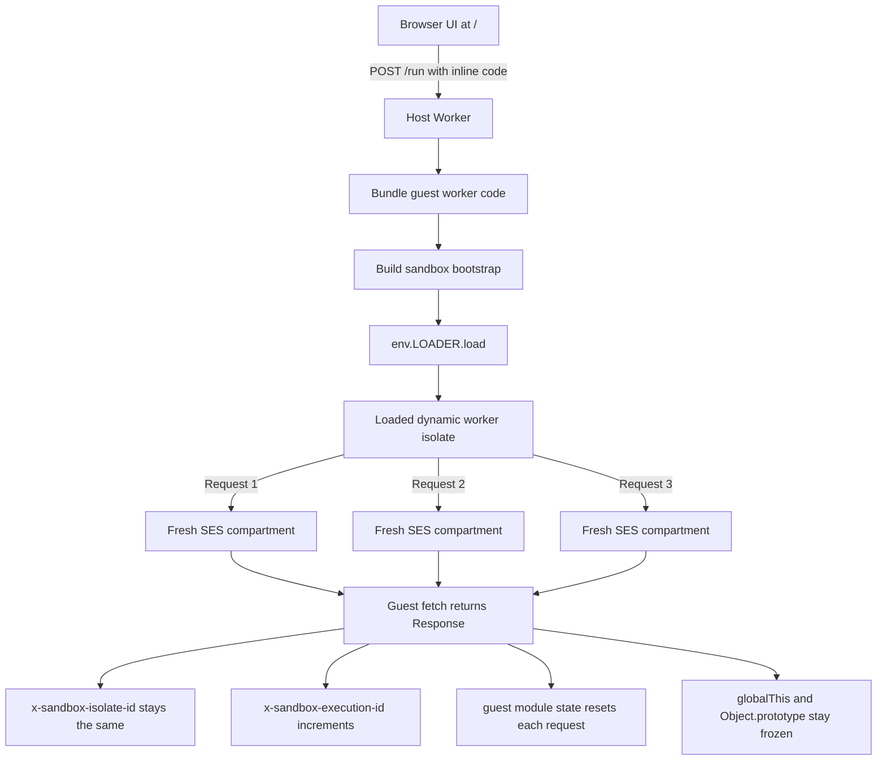

# Dynamic Worker Freeze

This example shows how to load user-provided Cloudflare Worker code dynamically, run it inside a SES-locked compartment, and keep cross-request state from leaking through mutable globals.

## What This Demonstrates

The example is built to prove a few specific things:

1. A dynamic Worker can be loaded once and reused for multiple requests.
2. Guest code can be executed inside a locked-down SES compartment instead of directly in the host Worker's global scope.
3. Each request gets a fresh guest execution environment, so top-level module state does not carry across requests.
4. Writes to shared globals such as `globalThis` and `Object.prototype` are blocked, which prevents prototype pollution and other ambient state leaks.

The demo page at `/` makes those behaviors visible.



## How To Read The Demo

The default code sample on the page:

1. Declares a top-level `let moduleCounter = 0`.
2. Increments it inside `fetch()`.
3. Tries to write to `globalThis`.
4. Tries to write to `Object.prototype`.
5. Returns the results as JSON.

When you press **Run**, the app sends three requests to the same dynamically loaded Worker.

If the sandbox is working correctly:

1. All three responses report the same `x-sandbox-isolate-id`, which shows the same loaded dynamic Worker isolate handled each request.
2. The `x-sandbox-execution-id` increases for each request, which shows each request was observed separately.
3. `moduleCounter` stays at `1` in every response, which shows guest module state was recreated for each request instead of being shared.
4. The global and prototype writes fail, which shows the runtime was frozen before guest code ran.

In short: the example demonstrates isolate reuse without guest global-state reuse.

## Routes

### `GET /`

Serves a small HTML UI for editing and running a single-file Worker.

### `POST /run`

Runs an inline single-file Worker and prints the output from three requests.

Current limitations:

1. Exactly one `export default` is required.
2. Only default exports are supported.
3. Imports are not supported on this route.

### `POST /execute`

Runs a sandbox from a JSON payload:

```json
{
  "entryPoint": "src/index.ts",
  "files": {
    "src/index.ts": "export default { async fetch() { return new Response('ok'); } };"
  },
  "request": {
    "method": "GET",
    "url": "https://sandbox.example/"
  }
}
```

This route is the more general version of the demo flow. It supports multiple files and resolves the entry point from `entryPoint`, `package.json`, or common defaults.

## Local Development

Install dependencies:

```sh
npm install
```

Start the Worker locally:

```sh
npm run dev
```

Wrangler serves the Worker locally during development. By default, `wrangler dev` exposes the app on `http://localhost:8787`.

Run tests:

```sh
npm test
```

Deploy:

```sh
npm run deploy
```

## Implementation Notes

1. `src/index.ts` exposes the UI and the `/execute` API.
2. `src/sandbox.ts` builds the guest Worker, wraps it in a bootstrap module, calls `lockdown()`, freezes globals, and attaches execution metadata headers.
3. `src/ui.ts` renders the demo page and starter code that makes the isolation behavior easy to observe.
4. `test/index.spec.ts` covers the bootstrap behavior, the demo UI, and the three-request isolate reuse flow.
